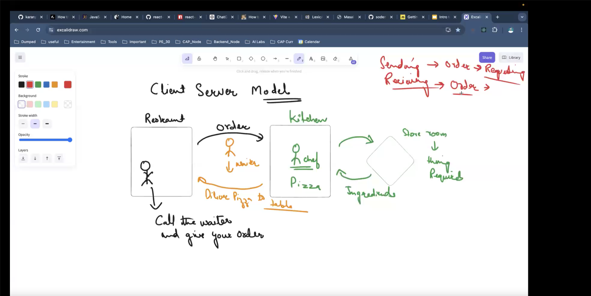
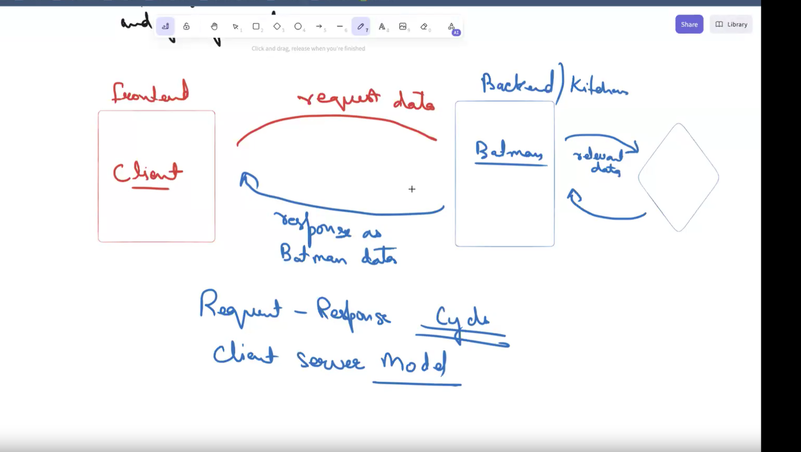
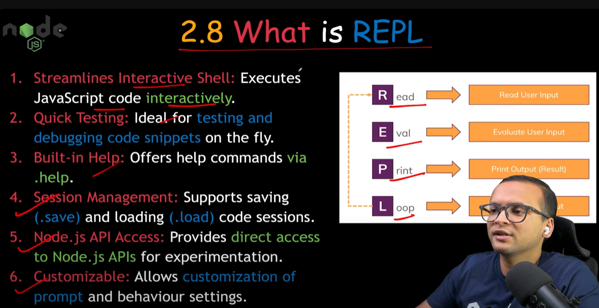
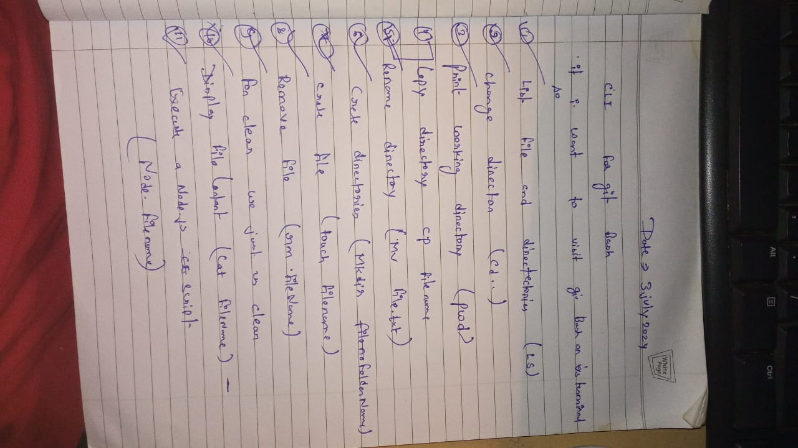

# Introduction to Node and Node.JS Basics
# Backend Development Notes
# Client-Server Model
# Request-Response Cycle
# Introduction to Node.js
# Ways to Interact with a Computer
# Importing and Exporting in Node.js
# The Event Loop in Node.js
# Asynchronous Programming in Node.js
# Error Handling in Node.js
Notes update


># Introduction to Node and Node.JS Basics

*Prerequisites 😛*

> Curiosity  
> Basic JavaScript
  - JavaScript Event loop ES6
  - Closures
  - Promises
  - Fetch
  - Async/await
  - Axios
  - GET
  - POST
  - PUT
  - PATCH
  - DELETE

> API
> JSON server

> Attention to details  
----------------------------------------------------------------------------------------

> Topics covered here

## Nodejs
- Using Different Node modules

## Express
- Building API 🥳
- Middlewares

## MongoDB
- Database
- Storing and Retrieving data

## Mongoose
- Connecting Database to our application

-----------------------------------------------------------------------------------

># Backend Development Notes

## Key Points

- **Focus**: Server-side tasks
- **Involves**:
  - Working with databases
  - Scripting
  - Website architecture
- **Operations**: Behind the scenes
- **Function**: Enables the frontend of a website to function
- **Communication**:
  - Backend communicates with the frontend
  - Sends and receives information to display web pages

## Required Skills

- **Frameworks**: Understanding and using various frameworks
- **Languages**: Proficiency in programming languages
- **Databases**: Knowledge and management of databases

--------------------------------------------------------------------------

># Client-Server Model

## Key Points

- **Structure**:
  - Distributed application with two main components:
    - **Servers**: Provide resources/services.
    - **Clients**: Request resources/services.
- **Communication**:
  - Typically over a network, but can be on the same system.
  - Clients and servers usually run on different hardware.
- **Roles**:
  - **Servers**:
    - Run server programs.
    - Share resources with clients.
  - **Clients**:
    - Request content or services from servers.
    - Do not share their own resources.
- **Interaction**:
  - Clients start communication.
  - Servers wait for and respond to requests.

This document explains the client-server model using a restaurant analogy to make the concept more understandable.

## Overview

In the client-server architecture, the client makes requests for services and the server provides those services. We will use a restaurant analogy to illustrate this interaction.

## Analogy: Restaurant



### Client

- **Representation**: A customer at a restaurant.
- **Actions**:
  1. Looks at the menu (input data).
  2. Orders the food.

### Server

- **server**: so basically server is a computer which serve the resources

- **Representation**: The kitchen in the restaurant.
- **Components**:
  - **Waiter**: Acts as an intermediary, taking orders from clients and delivering them to the kitchen, then bringing back the prepared food. This is similar to how `fetch` or `axios` functions handle HTTP requests.
  - **Chef**: Prepares the food based on orders received. Analogous to the server-side code that processes client requests.

### Database

- **Representation**: The storeroom in the restaurant.
- **Function**: Stores raw materials (data).
- **Interaction**: The kitchen (server) accesses the storeroom (database) to get the ingredients (data) needed to prepare the food (response). This is similar to using `mongoose` to interact with a MongoDB database.

## Flow of Actions

1. **Client**:
   - Uses a browser to send a request (like ordering food).
2. **Waiter**:
   - Fetches or uses `axios` to send the client's request to the server.
3. **Server**:
   - Processes the request using server-side code.
   - The chef reads the orders and prepares the food.
   - The server interacts with the database using `mongoose` to get the necessary data (raw materials).
4. **Database**:
   - Stores the data required by the server to process requests.
5. **Response**:
   - The prepared food (processed data) is sent back to the client through the waiter (HTTP response).

## Detailed Breakdown

- **Client**: Initiates the request by looking at the menu and ordering food.
  - **Browser**: Acts as the interface for the client.
  - **Actions**: Look at the menu (input data) and place an order (send request).

- **Waiter**: Acts as the intermediary.
  - **Tools**: `fetch` or `axios` for sending HTTP requests.
  - **Actions**: Takes the order (request) from the client and delivers it to the kitchen (server).

- **Server**: Processes the request.
  - **Kitchen**: Where the server-side code runs.
  - **Chef**: Executes the server-side logic to prepare the food (process the request).
  - **Actions**: Reads the orders, prepares the food, and interacts with the database if needed.

- **Database**: Stores the data required for the server to process requests.
  - **Storeroom**: Contains raw materials (data).
  - **Interaction**: The server (kitchen) accesses the storeroom to get the ingredients (data) needed for the orders.

- **Response**: The final product (processed data) is sent back to the client.
  - **Prepared Food**: The response sent back to the client via the waiter.

## Conclusion

This restaurant analogy helps in understanding the roles and interactions in a client-server architecture, highlighting the flow of data and responses in a web application.

---------------------------------------------------------------

># Request-Response Cycle

## Overview

The request-response cycle is fundamental to how web applications operate, ensuring that user requests are handled efficiently and data is retrieved and displayed correctly.



## Key Points

- **Frontend (FE)**:
  - The client side that interacts with the user.
  - Sends a request to the backend.

- **Backend (BE)**:
  - The server side that processes requests and communicates with the database.
  - Receives the request from the frontend.
  - Determines what kind of data is needed.
  - Queries the database for the required data.

- **Database (DB)**:
  - The storage system that holds the data.
  - Receives the query from the backend.
  - Sends the requested data back to the backend.

- **Backend Processing**:
  - Processes the data received from the database.
  - Sends a response back to the frontend.

- **Frontend Response**:
  - Receives the response from the backend.
  - Displays the data to the user.

## Detailed Breakdown

1. **Client Request**:
   - The frontend sends a request to the backend. This is represented by the arrow labeled "req".
   
2. **Backend Receives Request**:
   - The backend processes the request, determining the data needed. This step is indicated by the question "What kind of data do I need?".
   
3. **Backend Queries Database**:
   - The backend sends a query to the database to get the required data.
   
4. **Database Responds**:
   - The database sends the requested data back to the backend.
   
5. **Backend Processing**:
   - The backend processes the data and prepares it for the response. This is represented by the box labeled "Pizza".
   
6. **Response to Frontend**:
   - The backend sends the processed data back to the frontend. This is indicated by the arrow labeled "res".
   - The frontend receives the response and displays the data to the user.

By following this cycle, web applications ensure that user requests are handled smoothly and the necessary data is retrieved and displayed correctly.

---

># Server-Side Programming Languages

## Introduction

**Server-side programming** refers to operations performed by a server in response to client requests in a client-server architecture. This programming handles business logic, database interactions, authentication, and other critical server-side processes.

## Why Use Server-Side Programming?

1. **Data Processing**: Servers handle complex data tasks, like database queries and business logic.
2. **Security**: Sensitive operations, such as authentication and data validation, are managed server-side to enhance security.
3. **Performance**: Offloading intensive tasks to the server reduces the load on client devices.
4. **Consistency**: Centralized server-side code ensures consistent behavior across all users and sessions.

## How It Works

1. **Client Request**: A user action (e.g., clicking a button) sends a request to the server.
2. **Server Processing**: The server processes the request (e.g., fetching data from a database) and prepares a response.
3. **Response Sent**: The server sends back the response, which could be an HTML page, JSON data, etc.
4. **Client Render**: The client receives the response and displays the content to the user.

## Popular Server-Side Programming Languages

### JavaScript (Node.js)
- **Pros**: Asynchronous, event-driven, large ecosystem (NPM), uses JavaScript (same language as client-side).
- **Cons**: Less performant for CPU-intensive tasks.

### Python
- **Frameworks**: Django, Flask.
- **Pros**: Easy to learn, readable syntax, large community, rich set of libraries.
- **Cons**: Slower than compiled languages, GIL (Global Interpreter Lock) limits multi-threading.

### Ruby
- **Framework**: Ruby on Rails.
- **Pros**: Convention over configuration, developer-friendly, good for rapid development.
- **Cons**: Performance issues, smaller community compared to other languages.

### PHP
- **Frameworks**: Laravel, Symfony.
- **Pros**: Easy to deploy, widely used, lots of hosting options.
- **Cons**: Historical security issues, inconsistent design.

### Java
- **Frameworks**: Spring, Java EE.
- **Pros**: Strong performance, scalable, widely used in enterprise applications.
- **Cons**: Verbose syntax, complex for beginners.

### C# (ASP.NET)
- **Pros**: Strongly typed, integrates well with Microsoft services, powerful IDE (Visual Studio).
- **Cons**: Primarily Windows-focused, though .NET Core is cross-platform.

### Go
- **Pros**: Fast, efficient, good for concurrent programming.
- **Cons**: Relatively new, smaller ecosystem.

### Rust
- **Pros**: High performance, memory safety without a garbage collector.
- **Cons**: Steeper learning curve, smaller ecosystem.

### Kotlin
- **Pros**: Interoperable with Java, concise syntax.
- **Cons**: Smaller community than Java.

### Elixir
- **Framework**: Phoenix.
- **Pros**: Excellent for real-time applications, scalable, functional programming paradigm.
- **Cons**: Smaller community, steeper learning curve.

## Conclusion

Server-side programming languages are essential for creating robust, dynamic web applications. They ensure data is processed securely and efficiently, providing users with a seamless and interactive experience.


--------------------------------------------------------------------

---

># Introduction to Node.js

## Overview

- **Node.js**:
  - A runtime environment for executing JavaScript code on the server side.
  - Allows developers to use JavaScript for:
    - Writing command-line tools
    - Server-side scripting
  - Produces dynamic web page content on the server before sending it to the user's browser.

- **Paradigm**:
  - "JavaScript everywhere"
  - Unifies web application development with a single programming language for both server-side and client-side scripts.

## Example

```javascript
console.log('Hello, World!');
```
---

># what is a R -> E -> P -> L


---
# Execution Flow of a Node.js Application

## Local Setup:

1. **Install Node.js on your local machine:**
   - Download and install Node.js from [nodejs.org](https://nodejs.org/).

2. **Use NPM to install required packages:**
   - After installing Node.js, use the Node Package Manager (NPM) to install necessary packages for your application.

3. **Write JavaScript code that uses Node.js APIs and installed packages:**
   - Develop your application's functionality using JavaScript, leveraging Node.js APIs and any installed packages/modules.

## Running the Application:

1. **Node.js Runtime Initialization:**
   - When you run your Node.js application, the Node.js runtime starts.
   - It initializes the V8 JavaScript engine and core Node.js modules.

2. **JavaScript Code Execution:**
   - The JavaScript code written for your application is parsed by the V8 engine.
   - It is initially interpreted and then converted into bytecode by the Ignition compiler.

3. **Optimization to Machine Code:**
   - The TurboFan compiler optimizes the bytecode into highly efficient machine code, improving performance.

4. **Event Loop Handling Asynchronous Operations:**
   - Node.js applications are event-driven and non-blocking due to the event loop mechanism.
   - Asynchronous operations (like I/O operations or timers) are managed by the event loop, ensuring efficient handling without blocking the execution flow.

5. **Execution of Compiled Code:**
   - The optimized machine code generated by TurboFan is executed by the V8 engine.
   - This completes the execution cycle of your JavaScript code within the Node.js environment.

This flow illustrates how Node.js manages the execution of JavaScript applications, leveraging its runtime environment and V8 engine capabilities to ensure efficient performance and asynchronous operation handling.

---

># Ways to Interact with a Computer

## GUI (Graphical User Interface)
- **Definition**: A GUI allows users to interact with electronic devices using graphical icons and visual indicators.
- **Components**:
  - **Windows**: Rectangular areas for displaying output and allowing input.
  - **Icons**: Small graphical representations of programs, files, or functions.
  - **Menus**: Lists of options or commands that users can select.
  - **Buttons**: Elements that users can click to perform actions.
  - **Toolbars**: Sets of buttons or icons grouped together for quick access to commands.
- **Advantages**:
  - User-friendly and intuitive, especially for beginners.
  - Allows multitasking with multiple windows open simultaneously.
  - Visual feedback helps in understanding and navigating the system.
- **Disadvantages**:
  - Can be resource-intensive, requiring more memory and processing power.
  - May be slower for experienced users compared to CLI for certain tasks.
  - Limited control over the system compared to CLI.

## CLI (Command Line Interface)
- **Definition**: A CLI allows users to interact with the computer by typing text commands into a console or terminal.
- **Components**:
  - **Command Prompt**: Indicates that the system is ready to accept a command.
  - **Commands**: Text inputs that tell the computer to perform specific tasks.
  - **Shell**: The interface that processes commands and outputs results (e.g., Bash, PowerShell).



- **Advantages**:
  - Greater control and flexibility over the operating system and applications.
  - Can be faster and more efficient for experienced users.
  - Requires fewer system resources compared to GUI.
  - Facilitates automation through scripting.
- **Disadvantages**:
  - Steeper learning curve for beginners.
  - Commands must be typed precisely, leading to potential for errors.
  - Lack of visual feedback can make it harder to understand system state and navigate.

## Choosing Between GUI and CLI
- **User Experience**: GUIs are more accessible for most users, especially those who are not familiar with command syntax. CLIs are favored by advanced users and developers for their efficiency and control.
- **Task Type**:
  - **GUI**: Best for tasks involving graphic design, video editing, and other visually oriented activities.
  - **CLI**: Ideal for system administration, programming, and tasks that can be automated with scripts.
- **Performance**: CLIs typically use fewer system resources, making them suitable for environments with limited resources.
- **Learning Curve**: GUIs are generally easier to learn and use, while CLIs require more specialized knowledge and practice.

In summary, both GUI and CLI offer unique advantages and are suited to different types of tasks and user preferences. Understanding the strengths and weaknesses of each can help users choose the most appropriate interface for their needs.

-----------------------------------------------------------------------

# Importing and Exporting in Node.js

>### in commonJS

## Importing

To import variables or functions from another file in Node.js, you use the `require` function. This allows you to include the exports from one module into another.

### Syntax

```javascript
const { variableName } = require('moduleLocation');
```

## Exporting

To export variables or functions from a file so that they can be imported elsewhere, you use module.exports. This allows you to define what a module exports.

### Syntax

```javascript
module.exports = {
    variableName
};
```

----------------------------------------------------------------------------------

># Modules in Node.js


> anything which you export in js is called a module.

```In Node.js, a module is a code file that's used in a modular JavaScript application for the separation of concerns. Essentially, it's a set of functions you want to include in your application. Node.js has several built-in modules that you can use without any further installation. Additionally, you can create your own modules or import third-party modules via npm (Node Package Manager).```


1. what is a module in node?
2. anything in js is a module
  —> it should export something,
  —> it should not mess with other other modules.


### Example of importing built-in module

const fs = require('fs');
Example of creating and exporting a custom module:

```javascript in sum.js
function sum(a, b) {
  return a + b;
}
module.exports = sum;
```
Example of importing a custom module:


in app.js

```javascript
const sum = require('./sum');
console.log(sum(1, 2)); // 3
```

---------------------------------------------------------------------------------------------

## Overview

- **Node.js** is built on the **V8 JavaScript engine**.
- It comes with extra features that extend its capabilities beyond just running JavaScript.

># Core Modules

Node.js includes several inbuilt core modules, such as:

- `fs` (File System)
- `os` (Operating System)

># Submodules

- **sunblodule**: (More details required, please specify what sunblodule refers to.)

## Additional Features

Node.js supports various modules that can be installed for additional functionality. Some of the notable modules include:

- `fs`: File System operations
- `crypto`: Cryptographic functions
- `os`: Operating System utilities

## Types of Modules

># custom modules

Example : sum module (created by you)

># Internal Modules

- These come bundled with Node.js and are ready to use out of the box.
- Examples: `fs`, `crypto`, `os`.

Talk About 
# **FS** File system --> Related file
<!-- fs.readFile(path[, options], callback) -->
```
FS Module in Node.js
The fs (File System) module in Node.js allows you to work with the file system on your computer. This includes reading, writing, updating, deleting, and renaming files.
```

      --> read
      --> write 
      --> append 
      --> delete 
      --> rename

# **OS** 

```
OS Module in Node.js
The os module in Node.js provides a number of operating system-related utility methods and properties. It is used to interact with the underlying operating system. Here are some of the common functionalities provided by the os module:


OS Type
System Memory
Free System Memory
Interfaces
Architecture
Getting the Total Amount of System Memory:
Getting the Hostname:

```

# **crypto**

```
Crypto Module in Node.js
The crypto module in Node.js provides cryptographic functionality that includes a set of wrappers for OpenSSL's hash, HMAC, cipher, decipher, sign, and verify functions.
```

**These modules are essential for performing various tasks in Node.js, and they provide a wide range of functionalities to interact with the operating system, perform cryptographic operations, and manage the file system.**

># External Modules

- These are not included with Node.js and must be installed separately.
- Managed through **npm** (Node Package Manager).

### Example External Module

- `bpm i`: (More context needed, ensure this is correct or provide more details.)

## Installation of Modules

To install an external module using npm, use the following command:

```sh
npm install <module_name>

```
--------------------------------------------------------------------------

# The Event Loop in Node.js

The event loop is a fundamental aspect of Node.js, enabling it to perform non-blocking I/O operations. Despite JavaScript being single-threaded, thanks to the event loop, Node.js can handle multiple operations simultaneously through callbacks and promises.

## How the Event Loop Works

The event loop allows Node.js to offload operations to the system kernel whenever possible. The kernel is capable of handling multiple operations in the background. As these operations complete, the event loop queues them for execution.

### Key Phases of the Event Loop

1. **Timers**: This phase executes callbacks scheduled by `setTimeout` and `setInterval`.
2. **Pending Callbacks**: Executes I/O callbacks deferred to the next loop iteration.
3. **Idle, Prepare**: Internal use only.
4. **Poll**: Retrieves new I/O events; executes I/O-related callbacks.
5. **Check**: Executes `setImmediate` callbacks.
6. **Close Callbacks**: Executes close event callbacks (e.g., `socket.on('close', ...)`).

### Example

Here's a simple example to demonstrate how the event loop works:

```javascript
const fs = require('fs');

console.log('Start');

// Simulating a file read operation (asynchronous)
fs.readFile('example.txt', 'utf8', (err, data) => {
  if (err) {
    console.error(err);
    return;
  }
  console.log('File read complete');
});

setTimeout(() => {
  console.log('Timeout callback executed');
}, 0);

setImmediate(() => {
  console.log('Immediate callback executed');
});

console.log('End');

```
-----------------------------------------------

# Asynchronous Programming in Node.js

Node.js heavily relies on asynchronous programming to handle operations without blocking the thread. This is achieved using callbacks, promises, and the `async/await` syntax introduced in ECMAScript 2017. Asynchronous programming makes it possible to perform long network requests or file operations in the background, notifying the program via event listeners or callbacks when the operation has finished.

## Key Concepts

### Callbacks
A callback is a function passed as an argument to another function, which is then executed once the asynchronous operation completes.

### Promises
Promises represent the eventual completion (or failure) of an asynchronous operation and its resulting value. Promises provide `then()`, `catch()`, and `finally()` methods to handle asynchronous operations.

### Async/Await
Introduced in ECMAScript 2017, `async` and `await` provide a more readable and concise syntax for working with promises.

## Example of Async/Await

The `async` function allows you to write promise-based code as if it were synchronous. The `await` keyword is used to wait for a promise to resolve.

### Example Code

```javascript
// Example function using async/await
async function fetchData() {
  try {
    let response = await fetch('http://example.com/data');
    let data = await response.json();
    console.log(data);
  } catch (error) {
    console.error('Error fetching data:', error);
  }
}

fetchData();
```

----------------------------------------------

# Error Handling in Node.js

Effective error handling is crucial in Node.js applications to ensure reliability and stability. Errors in Node.js can be handled using `try/catch` blocks, domain modules for uncaught exceptions, or centralized error handling middleware in web applications using frameworks like Express.js.

## Key Concepts

### try/catch Blocks

The `try/catch` statement is used to handle exceptions in synchronous code. It allows you to catch errors and handle them gracefully without crashing the application.

### Domain Modules

Domain modules provide a way to handle multiple asynchronous operations as a group. They are useful for catching errors in asynchronous code, although they are deprecated in favor of other error handling patterns.

### Centralized Error Handling Middleware

In web applications, especially those built with frameworks like Express.js, centralized error handling middleware is used to catch and process errors that occur during request handling.

## Example of try/catch

The `try/catch` block can be used to handle errors in a synchronous context. Here’s an example:

```javascript
try {
  // Code that may throw an error
  let result = riskyOperation();
  console.log(result);
} catch (error) {
  console.error('An error occurred:', error);
}
```
