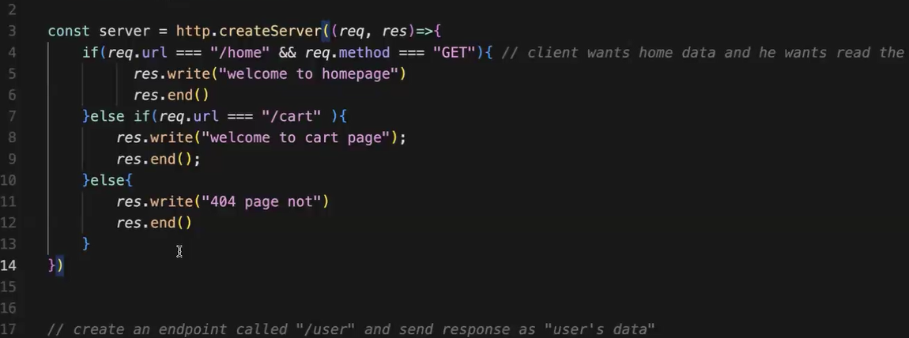

# Agenda  : HTTP Basics & Express

# HTTP Methods and Error Handling

## HTTP Methods

In RESTful APIs, different HTTP methods correspond to different actions:

1. **GET**: Used to **read** or retrieve data from the server.
2. **POST**: Used to **create** a new resource on the server.
3. **PUT** / **PATCH**: Used to **update** an existing resource on the server.
   - **PUT**: Generally used to update a resource entirely.
   - **PATCH**: Used to make partial updates to a resource.
4. **DELETE**: Used to **delete** a resource from the server.

Each method corresponds to a specific CRUD (Create, Read, Update, Delete) operation:

- **GET** -> Read
- **POST** -> Create
- **PUT**  : When you have to replace the whole the
   **PATCH** : Update when you want to update the particular field of add n ne field
- **DELETE** -> Delete

## Error Handling

When dealing with errors or issues in a system, different actions can be taken depending on the type of issue:

1. **If the type is broken:**
   - **Repair the patch:** Attempt to fix the issue with a patch.
   - **Replace the type:** If repairing the patch is not sufficient, replace the entire type or component.

This approach ensures that minor issues can be fixed quickly with patches, while more significant problems can be addressed by replacing the faulty component entirely.


-----------------------------------------------------------------------------

# URL Differences Comparison

## Domain and Accessibility

- **https://google.com**: This URL points to Google's public website, accessible globally.
- **http://localhost:3000/**: This URL points to a local server (localhost) on port 3000, accessible only on your machine.

## Purpose

- **https://google.com**: Used for accessing Google's web services publicly.
- **http://localhost:3000/**: Used for local development, testing, or debugging purposes.

## Security and Protocol

- **https://google.com**: Accessed over a secure connection (SSL/TLS).
- **http://localhost:3000/**: Accessed over an unsecure connection, not suitable for production.

## Port Number

- **https://google.com**: Uses default HTTPS port (443).
- **http://localhost:3000/**: Explicitly specifies port 3000 for local services.

In summary, [https://google.com](https://google.com) is publicly accessible and secure, while [http://localhost:3000/](http://localhost:3000/) is for local development and testing.


-----------------------------------------------------------

# Port Number Categories

## Reserved Ports

### Well-Known Ports (0-1023)
- Reserved for system services or commonly used protocols.
- Examples:
  - Port 80: HTTP (Hypertext Transfer Protocol)
  - Port 443: HTTPS (HTTP Secure)
  - Port 21: FTP (File Transfer Protocol)
  - Port 22: SSH (Secure Shell)
  - Port 25: SMTP (Simple Mail Transfer Protocol)
  - Port 110: POP3 (Post Office Protocol version 3)
  - Port 143: IMAP (Internet Message Access Protocol)
  - Port 53: DNS (Domain Name System)

### Registered Ports (1024-49151)
- Assigned by IANA (Internet Assigned Numbers Authority) to specific services or processes by request.
- Examples:
  - Port 3306: MySQL Database
  - Port 5432: PostgreSQL Database
  - Port 27017: MongoDB Database
  - Port 8080: HTTP Alternate (commonly used for web servers during development)

### Dynamic/Private Ports (49152-65535)
- Available for dynamic assignment and temporary use by client applications.

## Open Port Numbers

Open port numbers are those not reserved and can be used based on the needs of applications or services. For example:
- Ports like 3000, 5000, 8000, etc., often used by developers for local testing and development servers.
- Applications or services running on non-standard ports might choose numbers in the dynamic/private range for communication.


--------------------------------------------------------------------------------
problem is : again and again using if else if else 

solution is : express

why we use express because of 

there a a fig file using like if else if else so for optimize propose we use express

# Express is a backend web application framework for building RESTful APIs with Node.js

># Express.js Overview

Express.js is a minimal and flexible Node.js web application framework that simplifies the process of building server-side applications. It provides a robust set of features for handling routing, middleware, and HTTP requests and responses.

## Key Concepts

- **Routing**: Defines how the application responds to client requests to specific endpoints.
- **Middleware**: Functions with access to the request and response objects, used for tasks like authentication, logging, etc.
- **Request Handling**: Manages different HTTP methods (GET, POST, PUT, DELETE) and data handling.

## Getting Started

### Installation

You can install Express using npm:

```sh
npm install express
```

># Basic Setup

```javascript
const express = require('express');
const app = express();
const port = 3000;

app.get('/', (req, res) => {
  res.send('Hello World!');
});

app.listen(port, () => {
  console.log(`Server is running on http://localhost:${port}`);
});
```

># Basic Routing

```javascript
// GET request to the home page
app.get('/', (req, res) => {
  res.send('GET request to the homepage');
});

// POST request to the home page
app.post('/', (req, res) => {
  res.send('POST request to the homepage');
});

// PUT request to the /user page
app.put('/user', (req, res) => {
  res.send('PUT request to /user');
});

// DELETE request to the /user page
app.delete('/user', (req, res) => {
  res.send('DELETE request to /user');
});


// More routes for different HTTP methods

```

>#  Middleware

```javascript

app.use((req, res, next) => {
  console.log('Request URL:', req.originalUrl);
  next();
});

// Middleware for a specific route
app.use('/user/:id', (req, res, next) => {
  console.log('Request Type:', req.method);
  next();
});

app.get('/user/:id', (req, res, next) => {
  res.send(`User Info for ID: ${req.params.id}`);
});

```


># Using Middleware Libraries

```javascript
const bodyParser = require('body-parser');
const cookieParser = require('cookie-parser');

app.use(bodyParser.json());
app.use(cookieParser());

```

># Error Handling

```javascript
app.get('/error', (req, res, next) => {
  const err = new Error('Something went wrong!');
  next(err);
});

app.use((err, req, res, next) => {
  console.error(err.stack);
  res.status(500).send('Something broke!');
});

```

## Conclusion

>Express.js is a powerful framework for building web applications in Node.js. Its simplicity, flexibility, and rich ecosystem of middleware make it a popular choice among developers.