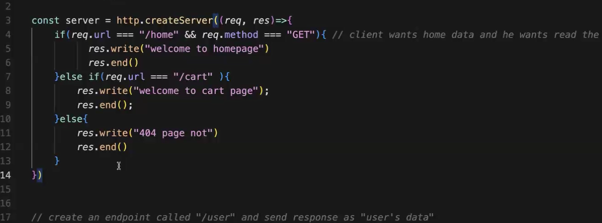

create a server
--> get request from client and i wilt send back response
--> client can request anytime i have to continuously listen yo incoming
requests.

--> server it's a process (system process) i have to give it a port number.

problem : Every change we need to  rerunning the server but this is ot a good thing

Solution : external modules --> store (npm) nodemon node mon node monitor it will monitor the changes in the file

>command to initialize a backend project
>nodemon node mon=> monitor

npm init --y
npm i nodemon

problem is : again and again using if else if else 

solution is : express

why we use express because of 

there a a fig file using like if else if else so for optimize propose we use express

two thing in our API'
      --> endpoint like "/cart"
      --> http verb like "GÜT"

 For creating end point --> endpoint like "/cart"
 res.send => res.write and res.end()

Restful api : Restful API: HTTPS methods and they perform operations on the resources (CRUD)

# RESTful API: HTTPS Methods and CRUD Operations

## Overview

A RESTful API is an architectural style for an application program interface (API) that uses HTTP requests to access and use data. The data can be used to GET, PUT, POST, and DELETE data types, which refers to the reading, updating, creating, and deleting of operations concerning resources.

## HTTP Methods

RESTful APIs use HTTP methods explicitly. There are several HTTP methods available, but the most commonly used for CRUD operations are:

- `GET`
- `POST`
- `PUT`
- `DELETE`