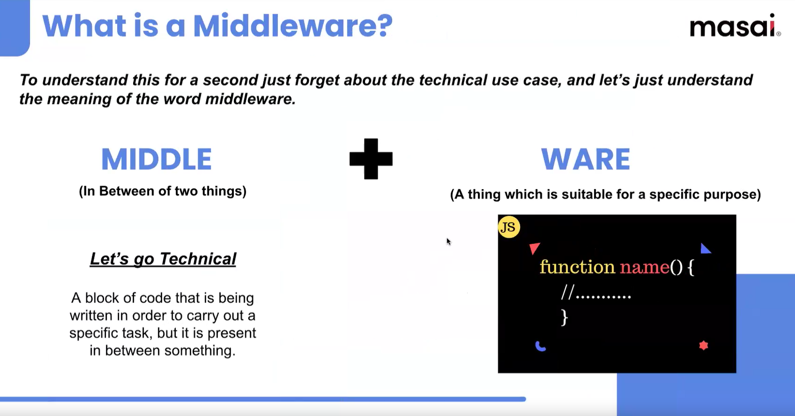
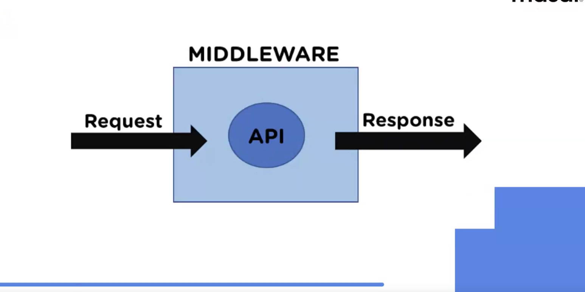
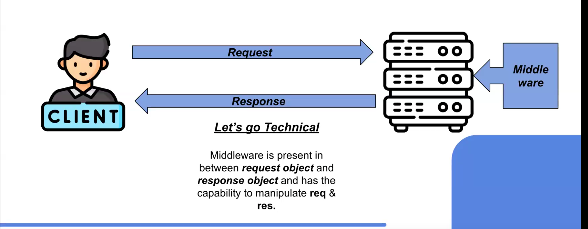

we descus here today

sever.use(express.jaon()) what it mean

# Express Middleware (ITS A CONCEPT)

>node has some inbuilt modules fs os crypto http path

1. node has external modules also npm nodemon express
2. we can make custom modules in node : sum function
3. express has some inbuilt middleware (ecosystem of middlewares)

express has some inbuilt middleware (ecosystem of middlewares)
1. internat
2. custom middleware
3. external

# What is a Middleware?

MIDDLE : (In Between of two things)
WARE : (A thing which is suitable for a specific purpose)

Middleware : A block of code that is being written in order to carry out a specific task, but it is present in between something.





# Where does a middleware exist?

Middleware is present in between request object and response object and has the capability to manipulate req & res.




```

what is the work of middleware
how to use middlware in the express

```