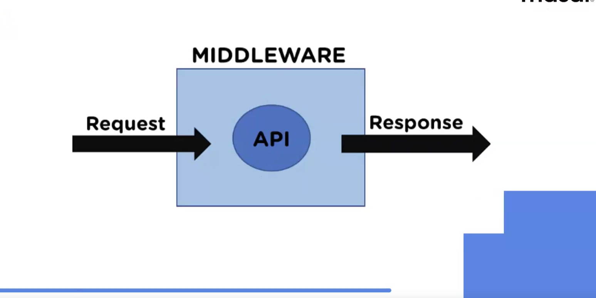
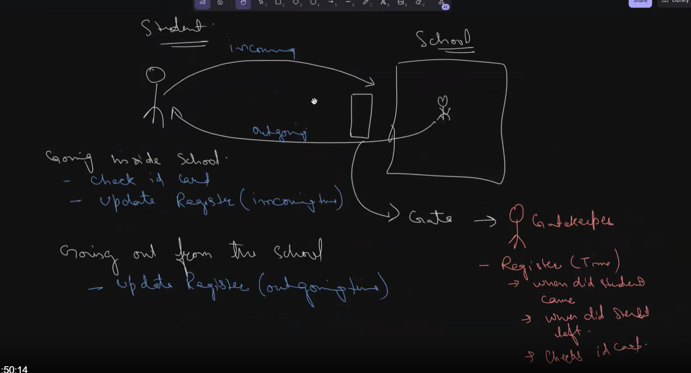
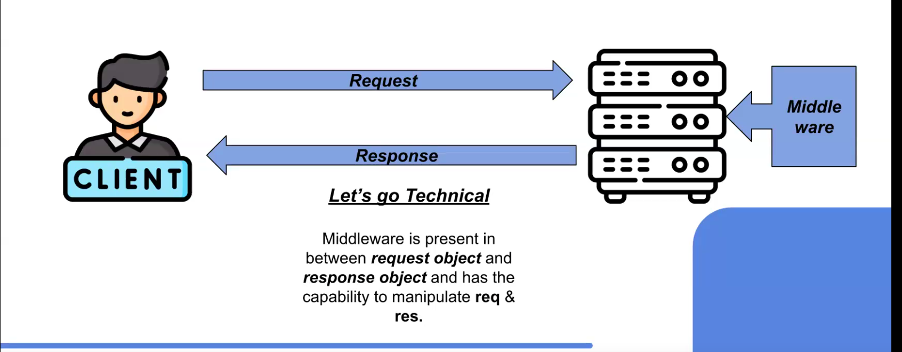

># Express Middleware (IT'S A CONCEPT)

> # Node
1. node has some inbuilt modules fs os crypto http path
2. node has external modules also npm nodemon express
3. we can make custom modules in node : sum function

# What is a Middleware?

- MIDDLE : (In Between of two things)
- WARE : (A thing which is suitable for a specific purpose)

Middleware : A block of code that is being written in order to carry out a specific task, but it is present in between something.





# Where does a middleware exist?

Middleware is present in between request object and response object and has the capability to manipulate req & res.


# Middleware Analogy

## Analogy Explanation with a student entering and exiting a school.

### Components in the Analogy

1. **Student:** Represents a request entering or exiting the system.
2. **School:** Represents the backend system or application.
3. **Gatekeeper:** Represents the middleware that processes the requests.

### Process Overview

1. **Going Inside the School:**
   - The student shows their ID card at the gate.
   - The gatekeeper checks the ID card and updates the register with the incoming time.

2. **Going Out from the School:**
   - The gatekeeper updates the register with the outgoing time when the student leaves.

The gatekeeper acts as a mediator between the student and the school, ensuring that the student’s movements are properly tracked.

## Middleware Analogy

Middleware in a software context is similar to the gatekeeper in this analogy. Here’s how:

### Middleware as a Gatekeeper

- **Request Entry:** When a request (student) comes into the system (school), it first passes through the middleware (gatekeeper).
- **Check and Process:** The middleware checks the request (ID card) for authentication and authorization. It ensures that the request is valid and can proceed further into the system.
- **Logging:** Middleware can log details about the request, such as when it came in (incoming time) and other relevant information.

### Middleware Tasks

- **Authentication:** Verifying the identity of the requester.
- **Authorization:** Ensuring the requester has the right permissions to access the resources.
- **Logging:** Keeping records of incoming and outgoing requests.
- **Data Transformation:** Converting the request data into a format that the backend can understand.
- **Routing:** Deciding where to send the request within the system.

### Request Exit

- When the request leaves the system (student going out), the middleware can update logs with the outgoing time and any other necessary details.

## Key Points

- **Middleware** is a crucial layer that sits between the client (student) and the server (school).
- It handles various tasks such as authentication, logging, data transformation, and routing, ensuring smooth and secure communication.
- Just like the gatekeeper ensures only authorized students enter and leave the school, middleware ensures that only valid and authorized requests pass through to the backend.

By performing these tasks, middleware enhances the security, logging, and management of requests in a software application, making it a vital component of modern web architectures.




# how to use middleware in the express
   - middleware will be a function
   
Syntax = `server.use(middleware ka name)`

**Keep Middleware at the Top: The note suggests that middleware should be placed at the top of your API endpoint configuration.**


# Purpose of next()

Pass Control: After completing its task, the middleware calls next() to pass control to the next middleware function. If next() is not called, the request will be left hanging and the subsequent middleware or route handler won't be executed.

Error Handling: If an error occurs, the middleware can pass an error to next(), which will skip all remaining non-error-handling middleware and pass the error to the error-handling middleware.

> two ways of using middleware in an Express application:

Globally: Use `server.use(middlewareName)` to apply middleware to all routes.
Specific Endpoints: Use `[middleware1, middleware2, ..., middlewareN]` as an array in the route handler to apply middleware to specific routes.

 If you want to apply middleware globally, you use server.use(middleware). If you want to apply it to specific routes, you need to apply the middleware directly to those routes.

# Types of Middleware

1. internal middleware 
2. external middleware
3. custom middleware

## Inbuilt Middleware
These are middleware functions that are built into the Express framework.

- **express.json()**: Parses incoming requests with JSON payloads and is based on `body-parser`.
- **express.text()**: Parses incoming requests with text payloads.
- **express.Router()**: Creates a new router object to handle a set of middleware and routes.

## Custom Middleware
These are middleware functions created by developers to handle specific tasks.

- **timeLogger()**: A custom middleware function that logs the time of the request.

  ```javascript
  const timeLogger = (req, res, next) => {
    console.log('Time:', Date.now());
    next();
  };
  ```

- **logger()**: Another example of a custom middleware function that might log details of the request.

```javascript
const logger = (req, res, next) => {
  console.log(`${req.method} ${req.url}`);
  next();
}
  ```

## Community Middleware
These are middleware functions developed and shared by the community, often available as npm packages.

- **cors()**: Middleware for enabling Cross-Origin Resource Sharing (CORS) with various options.

  ```javascript
  const cors = require('cors');
  app.use(cors());
  ```

- **multer()**: Middleware for handling `multipart/form-data`, which is primarily used for uploading files.

  ```javascript
  const multer = require('multer');
  const upload = multer({ dest: 'uploads/' });
  app.post('/profile', upload.single('avatar'), (req, res) => {
    res.send('File uploaded!');
  });
  ```

# Understanding `express.json()` Middleware in Express.js

## Overview

In an Express.js application, middleware functions play a crucial role in processing incoming requests. One of the commonly used middleware functions is `express.json()`, which is used to parse JSON payloads.

## Method: `server.use()`

- **Purpose:** Mounts middleware functions at the application level.
- **Access:** Middleware functions have access to the request object (`req`), the response object (`res`), and the next middleware function in the request-response cycle (`next`).

## Middleware: `express.json()`

- **Purpose:** A built-in middleware function in Express that parses incoming requests with JSON payloads and converts them into JavaScript objects.

## How It Works

1. **Incoming Request:**
   - A request is made to the server, and it first passes through any defined middleware functions.

2. **JSON Parsing:**
   - The `express.json()` middleware checks the `Content-Type` header of the incoming request. If the header is set to `application/json`, it proceeds to parse the request body.

3. **Body Parsing:**
   - The middleware reads the entire body of the request, parses it as JSON, and then converts it into a JavaScript object.

4. **Assign to `req.body`:**
   - The parsed JavaScript object is then assigned to `req.body`. This means that within any route handler or middleware function that follows, you can access the parsed JSON data via `req.body`.

5. **Error Handling:**
   - If the JSON is malformed or cannot be parsed, the middleware will automatically send a `400 Bad Request` response to the client.

6. **Route Handling:**
   - After parsing, the request continues to the next middleware or route handler in the stack. Route handlers can then use the parsed data from `req.body` to perform their logic.

## Example Usage

```javascript
const express = require('express');
const app = express();

// Use the express.json() middleware
app.use(express.json());

app.post('/data', (req, res) => {
  // Access the parsed JSON data
  const data = req.body;
  res.send(`Received data: ${JSON.stringify(data)}`);
});

app.listen(3000, () => {
  console.log('Server is running on port 3000');
});


---------------------------------------------------------------------

const express = require("express");
const app = express();
const PORT = 3000;

const accessChecker = (req, res, next) => {
  const accessCard = req.query.accessCard;
  if (accessCard === "valid-card") {
    next();
  } else {
    res.send("Access denied: valid access card required");
  }
};

app.get("/office", accessChecker, (req, res) => {
  res.send("Welcome to the office");
});

app.listen(PORT, () => {
  console.log(`Server is running on port ${PORT}`);
});

```

accessChecker middle ware


---

- **Middleware**: Middleware functions are functions that have access to the request object (`req`), the response object (`res`), and the next middleware function in the application’s request-response cycle. They can execute code, modify the request and response objects, end the request-response cycle, and call the next middleware in the stack.

    ```javascript
    app.use((req, res, next) => {
        console.log('Request URL:', req.url);
        next();
    });
    ```


##  Middleware in Express.js
Middleware in Express.js is a function that can access the request and response objects and can modify them before they are sent to the client. Middleware functions can perform a variety of tasks such as logging, authentication, and error handling.

```javascript
app.use((req, res, next) => {
    console.log('Middleware executing...');
    next();
});
```
## . Custom Middleware
You can create custom middleware to perform specific tasks in your application. For example, you can create a middleware function to log details of each request:

```javascript
const logRequestDetails = (req, res, next) => {
    console.log(`Received request: ${req.method} ${req.url}`);
    next();
};

app.use(logRequestDetails);
```

## . Using Middleware Libraries
Express.js allows you to use third-party middleware libraries to add extra functionality to your application. For example, `body-parser` is a popular middleware library used to parse incoming request bodies.

```javascript
const bodyParser = require('body-parser');
app.use(bodyParser.json());
```

## . Error Handling Middleware
Error-handling middleware is used to catch errors that occur during the execution of your application. These middleware functions have four arguments: error, request, response, and next.

```javascript
app.use((err, req, res, next) => {
    console.error(err.stack);
    res.status(500).send('Something went wrong!');
});
```