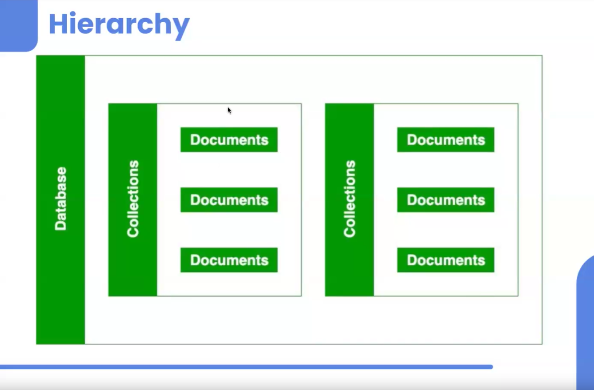

># Introduction to Databases
>## What is a Database?
>## Why do we store Data?
>## Why can't we use data files only?
>## What is the Solution?

># Introduction to Databases


>## What is a Database?

A **database** is a place where you can store a lot of information in an organized way so that you can easily find and use it later. Think of it like a digital filing cabinet where you can quickly locate any file you need.

>## Why do we store Data?

We store data for several important reasons:

1. **Keep it Safe:** To ensure that our information isn't lost and is available whenever we need it.
2. **Quick Access:** To quickly and easily find the information we need without searching through piles of files.
3. **Security:** To protect sensitive information from unauthorized access.
4. **Analyze Data:** To make informed decisions based on trends and patterns found in the data.
5. **Consistency:** To ensure the information is accurate and consistent across all uses.

>## Why can't we use data files only?

Using just plain data files (like text files or spreadsheets) has many drawbacks:

1. **Hard to Manage Large Data:** As the amount of data grows, it becomes difficult to manage and search through it.
2. **Slow Access:** Finding specific information can be slow and inefficient.
3. **Difficult to Keep Data Accurate:** Ensuring the information is consistent and correct is challenging.
4. **Limited Security:** Protecting data files from unauthorized access is harder.
5. **Concurrent Access Issues:** Managing multiple users accessing and changing the same file simultaneously can lead to conflicts and errors.
6. **Complex Backup:** Ensuring data files are backed up and can be recovered is complicated.

>## What is the Solution?

The solution is to use a **Database Management System (DBMS)**, which provides:

1. **Efficient Storage:** Keeps data organized for easy access and management.
2. **Fast Retrieval:** Allows you to quickly find and use the information you need.
3. **Data Integrity:** Ensures data is accurate and consistent.
4. **Security Features:** Protects data from unauthorized access.
5. **Handles Multiple Users:** Manages simultaneous access by multiple users without conflicts.
6. **Easy Backup and Recovery:** Simplifies the process of backing up and recovering data.

>## MongoDB

**MongoDB** is a type of database called a NoSQL database, which is different from traditional relational databases. Here's why MongoDB is useful:

1. **Document-Oriented:** Stores information in documents similar to JSON (a format that is easy for humans to read and write).
2. **Flexible Structure:** You can change the structure of your data easily without having to redesign the entire database.
3. **Scalable:** Can handle a large amount of data by spreading it across multiple servers.
4. **High Performance:** Designed to handle lots of read and write operations quickly.
5. **Rich Query Language:** Allows you to search and manipulate data in complex ways.
6. **Replication and Sharding:** Ensures data is safe and available by copying it across multiple servers and distributing it.

>## Summary

Databases, especially modern ones like MongoDB, provide a powerful way to store, manage, and retrieve data efficiently and securely. They overcome the limitations of using plain data files and are essential for handling large and complex data sets in today's applications.

---

># Types of Databases: SQL and NoSQL


>## SQL (Structured Query Language)
- **Definition:** SQL stands for Structured Query Language.
- **Characteristics:**
  - It is structured, meaning it uses a predefined schema to store data in tables with rows and columns.
  - The structure ensures data integrity and supports complex queries.
- **Examples:**
  - MySQL
  - Oracle SQL
  - PostgreSQL
  - MS SQL

>## NoSQL (Not Only SQL or Not a Structured Query Language)
- **Definition:** NoSQL stands for Not a Structured Query Language.
- **Characteristics:**
  - It is not structured, meaning it does not require a predefined schema.
  - It is flexible and can handle unstructured, semi-structured, or structured data.
- **Examples:**
  - MongoDB
  - Cassandra

>## Key Differences
- **Schema:**
  - **SQL Databases:** Use a fixed schema and tables with rows and columns.
  - **NoSQL Databases:** Schema-less or dynamic schema, allowing for flexible data models.
  
- **Data Integrity:**
  - **SQL Databases:** Enforce data integrity through relationships and constraints.
  - **NoSQL Databases:** Focus on scalability and performance, often at the expense of strict data integrity.
  
- **Scalability:**
  - **SQL Databases:** Typically scale vertically (adding more power to the existing machine).
  - **NoSQL Databases:** Typically scale horizontally (adding more machines to the system).

>## Use Cases
- **SQL Databases:** Suitable for applications requiring complex queries and transactions, such as financial systems, ERP systems, and traditional web applications.
- **NoSQL Databases:** Suitable for applications requiring high scalability, flexibility, and handling large volumes of unstructured data, such as real-time web applications, big data analytics, and IoT applications.

>## summary

SQL databases are ideal for structured data and complex queries, while NoSQL databases 
are designed for flexibility and scalability with unstructured or semi-structured data.

---

># Why MongoDB?


- **Flexibility**: MongoDB is very flexible, meaning it can easily adapt to a variety of data structures and requirements. This is particularly useful for applications that handle diverse data types and need to evolve over time.

- **Ease of Learning**: MongoDB is quick and easy to learn, making it accessible for developers who are new to database management systems. This helps in rapid development and reduces the learning curve.

- **JavaScript Syntax**: MongoDB uses a syntax that is similar to JavaScript, which is a common and widely-used programming language. This familiarity can make it easier for developers to start working with MongoDB without needing to learn a completely new query language.

- **Adoption by Companies**: Many companies are using MongoDB because of its flexibility. This widespread adoption suggests that MongoDB is a reliable and trusted solution for managing data.


## Example Document

The image also includes an example of a MongoDB document, which showcases its flexible schema design. The document is presented in JSON-like format with key-value pairs:

```json
{
    "name": "sue",
    "age": 26,
    "status": "A",
    "groups": ["news", "sports"]
}
```

This example highlights how MongoDB can store various types of data in a single document, making it a versatile choice for different applications.

---


># Basic Command


># MongoDB Hierarchy and Book Details Example

## MongoDB Hierarchy


1. **Database**: The top level in MongoDB's hierarchy. A single MongoDB server can have multiple databases, each serving different purposes.
2. **Collections**: Inside a database, we have collections. Collections are analogous to tables in a relational database, storing a group of related documents.
3. **Documents**: The basic unit of data in MongoDB. Documents consist of field-value pairs, similar to JSON objects.

## Example: Storing Book Details

### Database: Library

This database stores all the book-related collections.

### Collections

- **Fiction**
  - **Document**: 
    ```json
    {
      "title": "One Piece",
      "author": "Eiichiro Oda",
      "genre": "Adventure",
      "published_year": 1997
    }
    ```
- **Non-Fiction**
  - **Document**: 
    ```json
    {
      "title": "Atomic Habits",
      "author": "James Clear",
      "genre": "Self-help",
      "published_year": 2018
    }
    ```
- **Novels**
  - **Document**: 
    ```json
    {
      "title": "Pride and Prejudice",
      "author": "Jane Austen",
      "genre": "Romance",
      "published_year": 1813
    }
    ```
- **Education**
  - **Document**: 
    ```json
    {
      "title": "Introduction to Algorithms",
      "author": "Thomas H. Cormen",
      "genre": "Computer Science",
      "published_year": 1990
    }
    ```

## Summary

This hierarchy and example illustrate how MongoDB organizes data from databases to collections to individual documents. Each document within a collection represents a unique record, in this case, a book with its specific details.

># Database Collections and Documents

## 1. Creating a New Collection
- **Command:** `db.createCollection("collectionName")`
- **Purpose:** Use this command to create a new collection within the database.

## 2. Viewing Existing Collections
- **Command:** `show collections`
- **Purpose:** This command displays all collections present in the current database.

## 3. Using a Collection
- **Command:** `use collectionName`
- **Purpose:** Switches the context to the specified collection for further operations.

## 4. Working with Documents
- **To insert a document into a collection:**
  - **Command:** `db.collectionName.insertOne({ key: "value" })`
  - **Purpose:** Adds a new document to the specified collection.

- **To retrieve documents from a collection:**
  - **Command:** `db.collectionName.find()`
  - **Purpose:** Retrieves all documents within the specified collection.

## 5. Additional Commands
- **To see documents inside a collection:**
  - **Command:** `db.collectionName.find().pretty()`
  - **Purpose:** Displays documents in a readable format.

- **To count documents in a collection:**
  - **Command:** `db.collectionName.countDocuments()`
  - **Purpose:** Returns the total number of documents in the specified collection.


># CRUD Operations on Documents


CRUD stands for Create, Read, Update, and Delete. These are the four basic operations for managing data in a database. Here’s a detailed explanation of each operation with examples.

>## Create

### Creating DB (Database)
This step involves initializing a new database where you can store collections of data.

**Example:**
```shell
use myDatabase
```

### Creating Collections
A collection is similar to a table in relational databases. It holds multiple documents.

**Example:**
```shell
db.createCollection("myCollection")
```

### Inserting Documents
Documents are records in the collection, typically in JSON format.

**Example:**
```shell
db.myCollection.insertOne({ name: "John", age: 30, city: "New York" })
```

>## Read

### Reading Documents
This involves querying the database to retrieve documents.

**Example:**
```shell
db.myCollection.find()
```

### Filtering Documents
You can filter documents based on certain criteria to get specific results.

**Example:**
```shell
db.myCollection.find({ name: "John" })
```

>## Update

### Updating a Single Document
Modify a single document in the collection.

**Example:**
```shell
db.myCollection.updateOne({ name: "John" }, { $set: { age: 31 } })
```

### Updating Multiple Documents
Modify multiple documents that match certain criteria.

**Example:**
```shell
db.myCollection.updateMany({ age: 30 }, { $set: { city: "Los Angeles" } })
```

>## Delete

### Deleting a Single Document
Remove a single document from the collection.

**Example:**
```shell
db.myCollection.deleteOne({ name: "John" })
```

### Deleting Multiple Documents
Remove multiple documents that match certain criteria.

**Example:**
```shell
db.myCollection.deleteMany({ age: 30 })
```

>## Practical Example

Let's walk through a practical example using a library database:

1. **Create**:
   - Create a new database for the library:
     ```shell
     use libraryDB
     ```
   - Create a collection for books:
     ```shell
     db.createCollection("books")
     ```
   - Insert a book document:
     ```shell
     db.books.insertOne({ title: "To Kill a Mockingbird", author: "Harper Lee", year: 1960 })
     ```

2. **Read**:
   - Retrieve all books:
     ```shell
     db.books.find()
     ```
   - Filter books by author:
     ```shell
     db.books.find({ author: "Harper Lee" })
     ```

3. **Update**:
   - Update the year of a specific book:
     ```shell
     db.books.updateOne({ title: "To Kill a Mockingbird" }, { $set: { year: 1961 } })
     ```
   - Update the author for multiple books:
     ```shell
     db.books.updateMany({ author: "Unknown" }, { $set: { author: "Various Authors" } })
     ```

4. **Delete**:
   - Delete a specific book:
     ```shell
     db.books.deleteOne({ title: "To Kill a Mockingbird" })
     ```
   - Delete multiple books by a certain author:
     ```shell
     db.books.deleteMany({ author: "Various Authors" })
     ```


># CRUD Operations in MongoDB

## CRUD Overview

CRUD stands for Create, Read, Update, and Delete. These are the four basic operations you can perform on data in a database.

### Create (C)
- **insertOne**: Adds a single document to the collection.
- **insertMany**: Adds multiple documents to the collection.

### Read (R)
- **find()**: Retrieves all documents in the collection.
- **find({filter})**: Retrieves documents that match the specified filter criteria.
- **findOne**: Retrieves a single document that matches the filter criteria.

### Update (U)
- **updateOne**: Updates a single document that matches the filter criteria.
- **updateMany**: Updates multiple documents that match the filter criteria.

### Delete (D)
- **deleteOne**: Deletes a single document that matches the filter criteria.
- **deleteMany**: Deletes multiple documents that match the filter criteria.

## Notes
1. **To update something, we need two things:**
    - **Filter**: Specifies which document(s) to update, often using fields like `name` or `id`.
    - **What to update**: Specifies the new values for the fields to be updated.

2. **To delete something, we need one thing:**
    - **Filter**: Specifies which document(s) to delete, often using fields like `name` or `id`.

## Summary
- **Create** operations use `insertOne` and `insertMany`.

 ``` db.users.insertOne({name:"susheel", org:"Home"})```
 ``` db.users.insertMany([{},{},{}])```
- **Read** operations use `find()`, `find({filter})`, and `findOne`.
- **Update** operations use `updateOne` and `updateMany`, requiring both a filter and the update details.
- **Delete** operations use `deleteOne` and `deleteMany`, requiring only a filter.

this is all about CRUD operations in mongoDB

># Comparison & Logical Operators


## Comparison Operators

In MongoDB, comparison operators help filter data based on specific criteria:

| Symbol | MongoDB Syntax |
|--------|----------------|
| <=     | lte            |
| <      | lt             |
| >=     | gte            |
| >      | gt             |
| ==     | eq             |
| !=     | ne             |


# MongoDB Comparison and Logical Operator Practice

## MongoDB Practice Queries:

1. **Find all friends with health greater than 80**:
   ```js
   db.friends.find({ health: { $gt: 80 } })
   ```

2. **Find a specific friend by name (e.g., Vartika)**:
   ```js
   db.friends.find({ name: "Vartika" })
   ```

3. **Find friends whose villains' health is greater than 65**:
   ```js
   db.friends.find({ "villains.health": { $gt: 65 } })
   ```

4. **Find friends who have a favorite color of "blue" or "green"**:
   ```js
   db.friends.find({ "metadata.favouriteColor": { $in: ["blue", "green"] } })
   ```

5. **Find friends who are younger than 27 years**:
   ```js
   db.friends.find({ "metadata.age": { $lt: 27 } })
   ```

6. **Find friends whose health is less than or equal to 85 and are older than 26 years**:
   ```js
   db.friends.find({ $and: [{ health: { $lte: 85 } }, { "metadata.age": { $gt: 26 } }] })
   ```

7. **Find friends with either a power of "leadership" or a villain named "Doubt"**:
   ```js
   db.friends.find({ $or: [{ powers: "leadership" }, { "villains.name": "Doubt" }] })
   ```

8. **Find friends whose health is not equal to 90**:
   ```js
   db.friends.find({ health: { $ne: 90 } })
   ```

9. **Find friends whose age is between 25 and 28**:
   ```js
   db.friends.find({ "metadata.age": { $gte: 25, $lte: 28 } })
   ```

10. **Find friends with a favorite color other than "blue"**:
    ```js
    db.friends.find({ "metadata.favouriteColor": { $ne: "blue" } })
    ```

# Advanced Data Filtering in MongoDB


### Example Queries:

- **Find heroes with health ≤ 50**:
    ```js
    db.heroes.find({health: {$lte:50}}).pretty()
    ```

- **Find heroes with health not equal to 86**:
    ```js
    db.heroes.find({health: {$ne:86}}).pretty()
    ```

- For equality comparison (`==`), you don't need to use `eq`:
    ```js
    db.heroes.find({health:86})
    ```

## Logical Operators

Logical operators such as `and` and `or` are used for more advanced data filtering.

### Example Queries:

- **Find all users with `org` as 'Masai' and `country` as 'India'**:
    ```js
    db.users.find({$and:[{org:"Masai"}, {country:"India"}]}).pretty()
    ```

- **Find heroes with health between 40 and 60**:
    ```js
    db.heroes.find({$and:[{health:{$gt:40}}, {health:{$lt:60}}]}).pretty()
    ```

## Updating Documents

- **Add 'country: India' to all user documents**:
    ```js
    db.users.updateMany({},{$set: {country:"India"}})
    ```

## Limiting and Skipping Results

You can limit and skip results for better control over data retrieval, useful for **pagination**.

- **Limit to 2 documents**:
    ```js
    db.heroes.find().limit(2).pretty()
    ```

- **Skip 2 documents and then limit to the next 2**:
    ```js
    db.users.find({country:"India"}).skip(2).limit(2).pretty()
    ```

## Sorting

Sort data in **ascending** or **descending** order.

- **Sort heroes by health in ascending order**:
    ```js
    db.heroes.find().sort({health:1}).pretty()
    ```

- **Sort in descending order**:
    ```js
    db.heroes.find().sort({health:-1}).pretty()
    ```

**Note:** Sorting works with both numbers and alphabets based on **ASCII** values. Be mindful of case sensitivity.
"""