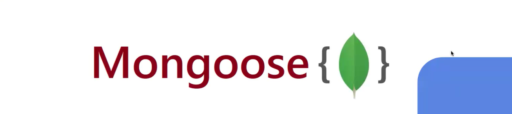
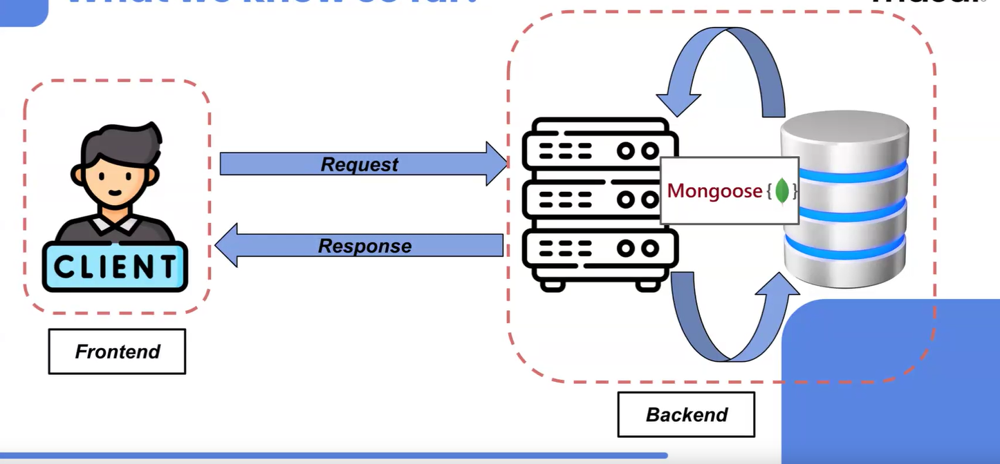

Here wo discuss about Mongoose

># Web Application Architecture

## Client (Frontend)
- The user interacts with the frontend, which sends requests to the backend.
- The frontend is responsible for the user interface and user experience.

## Server (Backend)
- The backend processes the requests received from the frontend.
- It is responsible for the business logic, authentication, and communication with the database.

## Database
- The database stores the application's data.
- The backend interacts with the database to retrieve or store data.

## Mongoose
- Mongoose is an Object Data Modeling (ODM) library for MongoDB and Node.js.
- It provides a schema-based solution to model application data.
- In the diagram, Mongoose is shown as the intermediary between the server and the database.

## Request and Response Flow
- The client sends a request to the server.
- The server processes the request, possibly interacting with the database through Mongoose.
- The server sends a response back to the client.
"""

Mongoose :
Basics of Mongoose, including the connection, structuring and
validation.
Connecting the DB with an express app and performing CRUD.